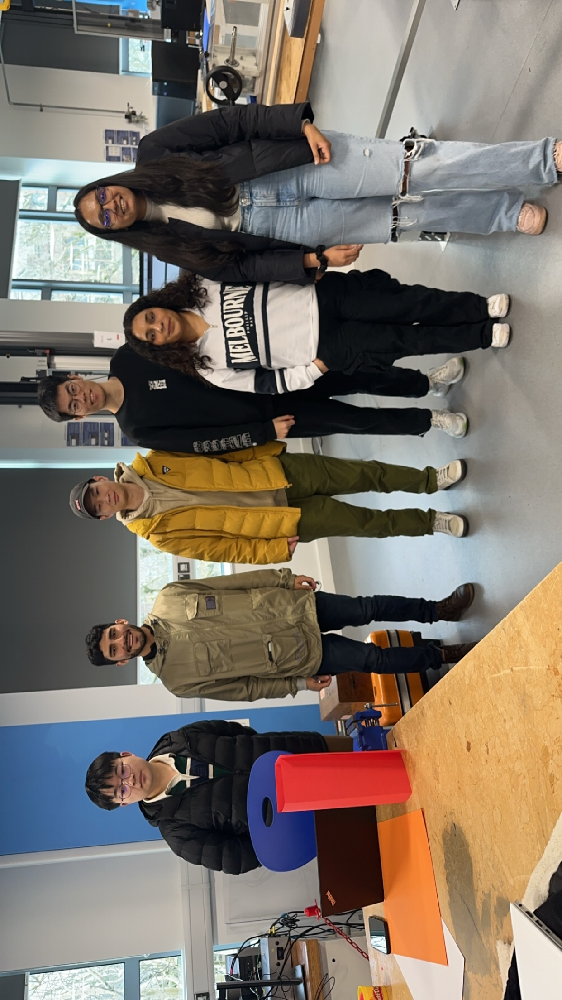

# Repo of UoB-Interactive Devices-2024-TeamF

## TAs ##
- Primary TA: Oliver
- Secondary TA: Sven

## Meet the team

From the left : Eric Yang, Santiago Ayala, Senyi Luo, Haohan Feng, Kaushiki Mudgal, Khushi Agarwal.

## Group Report ##

[Draft Paper](https://www.overleaf.com/read/brwqzwrvnbwb#e0ddff "Team F")

## Related Papers ##
*I'm currently in the process of reading these papers, so please note that some of them might not be entirely relevant or suitable for our ideas.
Please check the two html files for the list of papers.

## Abstract and Intro ##
I have added a file containing this.

## Design and implementation ##
Currently Kaushiki and Khushi are working on the final design implementation and first study.

## Indoor Positioning ##
[Idea](https://github.com/UoB-Interactive-Devices/ID24-TeamF/blob/master/Indoor%20Positioning.md)
